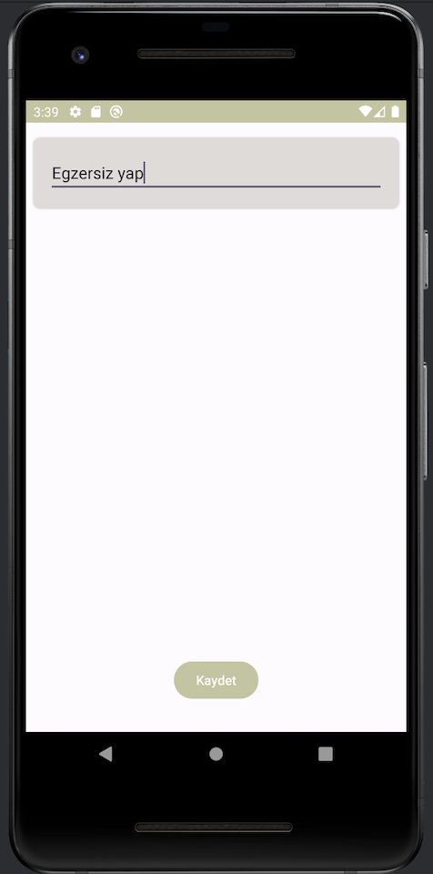
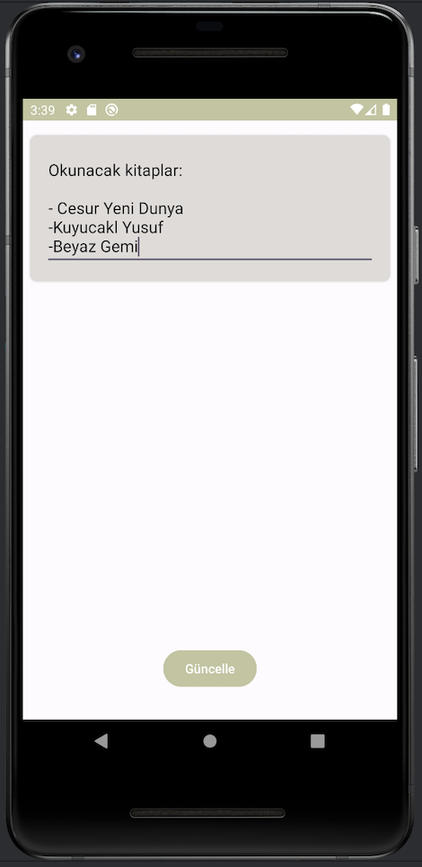

# ToDoApp

Bu proje,  MVVM, Dagger Hilt, Room ve Coroutines gibi teknolojilerin nasıl kullanılacağını gösteren bir örnek bir To-Do uygulamasını içerir. 
Bu projeyi, TechCareer Android Bootcamp programının bir parçası olarak tamamladım.

## Kullanılan Teknolojiler

- **MVVM (Model-View-ViewModel)**: Uygulama mimarisi MVVM kullanarak tasarlandı.
- **Dagger Hilt (Dependency Injection)**: Bağımlılık enjeksiyonu için Dagger Hilt kullanarak uygulama içi bağımlılıklar yönetildi.
- **Room**: SQLite veritabanını kullanarak yerel verileri yönetmek için Room kullanıldı.
- **Coroutines**: Asenkron işlemleri yönetmek için Coroutines kullanarak kodun daha okunabilir ve etkili olması sağlandı.

## Arayüz

  
  
  
 

